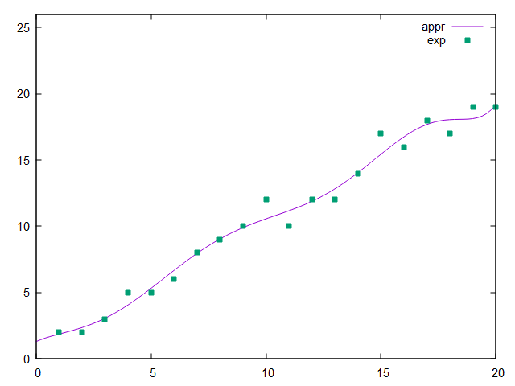

==========================
Least Square Approximation
==========================

A computer program in C++ programming language to compose a least square approximation.

Plot the graph of a point cloud and regression polynomial.

Dataset is random.

=======
Example
=======

Dataset
*******

Data set with 20 points and build its polynomial approximation with the degree 8.

.. code:: text

      20
      1.0000 2.0000
      2.0000 2.0000
      3.0000 3.0000
      4.0000 5.0000
      5.0000 5.0000
      6.0000 6.0000
      7.0000 8.0000
      8.0000 9.0000
      9.0000 10.0000
      10.0000 12.0000
      11.0000 10.0000
      12.0000 12.0000
      13.0000 12.0000
      14.0000 14.0000
      15.0000 17.0000
      16.0000 16.0000
      17.0000 18.0000
      18.0000 17.0000
      19.0000 19.0000
      20.0000 19.0000
      8

Chart
*****

